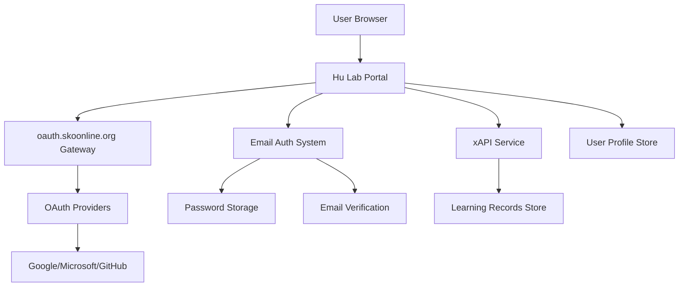

# 🔐 User Management System - Hu Lab Portal

## Executive Summary

This document outlines a comprehensive, intuitive user management approach for the Hu Lab Portal, supporting both OAuth providers via `oauth.skoonline.org` and traditional email/password authentication to provide maximum accessibility and user choice.

## 🎯 Design Principles

### 1. **Simplicity First**
- Single-click authentication via OAuth providers
- Simple email registration for non-OAuth users
- Automatic user provisioning
- Minimal user friction
- Multiple authentication paths

### 2. **Security by Design**
- Centralized OAuth authentication via oauth.skoonline.org
- Secure password hashing for email users (bcrypt)
- Email verification for all registration types
- Token-based session management
- Rate limiting and security monitoring

### 3. **Educational Focus**
- Role-based access (Student, Educator, Researcher, Admin)
- Dynamic permission system
- Learning analytics integration
- xAPI compliance for educational tracking

## 🏗️ System Architecture



## 🚀 Authentication Flows

### **Approach 1: OAuth Gateway (Recommended)**

```javascript
// 1. User clicks "Sign in with Education Account"
window.location.href = 'https://oauth.skoonline.org/auth/google/login?return_url=' + 
                      encodeURIComponent(window.location.origin + '/auth/callback');

// 2. OAuth proxy handles provider selection and verification
// 3. User returns with verified token
// 4. System automatically creates/updates user profile
// 5. Redirect to dashboard with full authentication
```

### **Approach 2: Email Registration & Login**

```javascript
// 1. User chooses "Sign up with Email"
const registrationData = {
    email: 'user@example.com',
    password: 'securePassword123',
    name: 'John Doe',
    confirmPassword: 'securePassword123'
};

// 2. System validates and creates account
await authService.registerWithEmail(registrationData);

// 3. Email verification sent
// 4. User clicks verification link
// 5. Account activated and login enabled
```

### **Approach 3: Unified Login Experience**

```javascript
// Single login page with multiple options
class UnifiedAuthService {
    // OAuth login
    async loginWithOAuth(provider) {
        window.location.href = `https://oauth.skoonline.org/auth/${provider}/login?return_url=${this.returnUrl}`;
    }
    
    // Email login
    async loginWithEmail(email, password) {
        const response = await fetch('/auth/email/login', {
            method: 'POST',
            headers: { 'Content-Type': 'application/json' },
            body: JSON.stringify({ email, password })
        });
        
        if (response.ok) {
            const { token, user } = await response.json();
            this.handleSuccessfulLogin(token, user);
        }
    }
}
```

### **Key Improvements Over Current System:**
- ✅ Multiple authentication methods (OAuth + Email)
- ✅ Single sign-on across all OAuth providers
- ✅ Email verification for all registration types
- ✅ Automatic token refresh
- ✅ Centralized session management
- ✅ Built-in security monitoring
- ✅ Accessibility for users without OAuth accounts

## 👥 User Lifecycle Management

### **1. Registration Process**

#### **OAuth Registration (Automatic)**
```javascript
async function handleNewOAuthUser(oauthToken) {
    // Automatic user creation on first login
    const userInfo = await fetchUserInfo(oauthToken);
    
    const newUser = {
        id: userInfo.sub,
        email: userInfo.email,
        name: userInfo.name,
        avatar: userInfo.picture,
        provider: userInfo.provider,
        role: determineRole(userInfo.email),
        status: 'active',
        emailVerified: true, // OAuth providers guarantee verified emails
        createdAt: new Date().toISOString(),
        preferences: getDefaultPreferences(),
        permissions: getRolePermissions(role)
    };
    
    await xapiService.createUserProfile(newUser);
    await xapiService.trackRegistration(newUser, 'oauth');
    
    return newUser;
}
```

#### **Email Registration (Manual)**
```javascript
class EmailRegistrationService {
    async registerWithEmail(registrationData) {
        // Validate registration data
        await this.validateRegistration(registrationData);
        
        // Check if email already exists
        const existingUser = await xapiService.getUserByEmail(registrationData.email);
        if (existingUser) {
            throw new Error('Email already registered. Try logging in instead.');
        }
        
        // Hash password securely
        const hashedPassword = await bcrypt.hash(registrationData.password, 12);
        
        // Create user profile
        const newUser = {
            id: generateUniqueId(),
            email: registrationData.email,
            name: registrationData.name,
            password: hashedPassword,
            provider: 'email',
            role: determineRole(registrationData.email),
            status: 'pending_verification',
            emailVerified: false,
            createdAt: new Date().toISOString(),
            preferences: getDefaultPreferences(),
            permissions: getRolePermissions(this.role)
        };
        
        // Generate email verification token
        const verificationToken = await this.generateVerificationToken(newUser.email);
        
        // Save user and send verification email
        await xapiService.createUserProfile(newUser);
        await this.sendVerificationEmail(newUser.email, verificationToken);
        await xapiService.trackRegistration(newUser, 'email');
        
        return {
            success: true,
            message: 'Registration successful. Please check your email to verify your account.',
            userId: newUser.id
        };
    }
    
    async verifyEmail(token) {
        // Validate verification token
        const email = await this.validateVerificationToken(token);
        
        // Update user status
        const user = await xapiService.getUserByEmail(email);
        user.status = 'active';
        user.emailVerified = true;
        user.verifiedAt = new Date().toISOString();
        
        await xapiService.saveUserProfile(email, user);
        await xapiService.trackEmailVerification(email);
        
        return user;
    }
    
    async validateRegistration(data) {
        const errors = [];
        
        // Email validation
        if (!data.email || !this.isValidEmail(data.email)) {
            errors.push('Valid email address required');
        }
        
        // Password validation
        if (!data.password || data.password.length < 8) {
            errors.push('Password must be at least 8 characters long');
        }
        
        if (!/(?=.*[a-z])(?=.*[A-Z])(?=.*\d)/.test(data.password)) {
            errors.push('Password must contain uppercase, lowercase, and numeric characters');
        }
        
        // Name validation
        if (!data.name || data.name.trim().length < 2) {
            errors.push('Full name required (minimum 2 characters)');
        }
        
        // Confirm password
        if (data.password !== data.confirmPassword) {
            errors.push('Passwords do not match');
        }
        
        if (errors.length > 0) {
            throw new ValidationError(errors);
        }
    }
}
```

**Role Assignment Logic:**
- `@polyu.edu.hk` → Automatic PolyU member recognition
- Faculty domains → Educator role
- Student domains → Student role
- External domains → Researcher role (pending approval)
- Whitelist domains → Immediate access

### **2. Login Process**

#### **OAuth Login**
```javascript
class OAuthAuthenticationService {
    async authenticateOAuthUser(token) {
        // Verify token with OAuth gateway
        const userInfo = await this.verifyOAuthToken(token);
        
        // Check if user exists
        let user = await xapiService.getUserProfile(userInfo.email);
        
        if (!user) {
            // First-time OAuth login - create user
            user = await this.handleNewOAuthUser(userInfo);
        } else {
            // Update last login and session info
            user = await this.updateUserSession(user, userInfo);
        }
        
        // Track login activity
        await xapiService.trackLogin(user, 'oauth');
        
        return user;
    }
}
```

#### **Email Login**
```javascript
class EmailAuthenticationService {
    async authenticateEmailUser(email, password) {
        // Find user by email
        const user = await xapiService.getUserByEmail(email);
        
        if (!user) {
            throw new AuthenticationError('Invalid email or password');
        }
        
        // Check if account is email-based
        if (user.provider !== 'email') {
            throw new AuthenticationError(`This email is registered with ${user.provider}. Please use ${user.provider} login instead.`);
        }
        
        // Check if email is verified
        if (!user.emailVerified) {
            throw new EmailNotVerifiedError('Please verify your email address before logging in');
        }
        
        // Check if account is active
        if (user.status !== 'active') {
            throw new AccountInactiveError('Your account is not active. Please contact support.');
        }
        
        // Verify password
        const passwordMatch = await bcrypt.compare(password, user.password);
        if (!passwordMatch) {
            // Track failed login attempt
            await this.trackFailedLogin(email);
            throw new AuthenticationError('Invalid email or password');
        }
        
        // Check for account lockout
        await this.checkAccountLockout(user);
        
        // Update last login
        user.lastLogin = new Date().toISOString();
        user.loginCount = (user.loginCount || 0) + 1;
        await xapiService.saveUserProfile(email, user);
        
        // Track successful login
        await xapiService.trackLogin(user, 'email');
        
        // Clear any failed login attempts
        await this.clearFailedLoginAttempts(email);
        
        return user;
    }
    
    async trackFailedLogin(email) {
        const attempts = await this.getFailedAttempts(email);
        const newCount = (attempts.count || 0) + 1;
        
        await this.storeFailedAttempts(email, {
            count: newCount,
            lastAttempt: new Date().toISOString(),
            lockUntil: newCount >= 5 ? new Date(Date.now() + 15 * 60 * 1000) : null // 15 min lockout after 5 failed attempts
        });
    }
    
    async checkAccountLockout(user) {
        const attempts = await this.getFailedAttempts(user.email);
        
        if (attempts.lockUntil && new Date() < new Date(attempts.lockUntil)) {
            throw new AccountLockedError('Account temporarily locked due to failed login attempts. Please try again later.');
        }
    }
}
```

#### **Unified Login Service**
```javascript
class UnifiedAuthService {
    async login(loginData) {
        try {
            if (loginData.provider === 'oauth') {
                return await this.oauthService.authenticateOAuthUser(loginData.token);
            } else {
                return await this.emailService.authenticateEmailUser(loginData.email, loginData.password);
            }
        } catch (error) {
            // Log authentication failure
            await this.logAuthFailure(loginData, error);
            throw error;
        }
    }
}
```

### **3. Profile Management**

```javascript
class ProfileManager {
    async updateProfile(userId, updates) {
        const user = await xapiService.getUserProfile(userId);
        
        // Validate updates
        const allowedFields = ['displayName', 'bio', 'department', 'interests', 'preferences'];
        const safeUpdates = pick(updates, allowedFields);
        
        // Merge with existing profile
        const updatedUser = {
            ...user,
            ...safeUpdates,
            updatedAt: new Date().toISOString()
        };
        
        await xapiService.saveUserProfile(userId, updatedUser);
        await xapiService.trackProfileUpdate(userId, Object.keys(safeUpdates));
        
        return updatedUser;
    }
}
```

## 🔑 Password Reset & Account Recovery

### **Hybrid Recovery System**

#### **For OAuth Users**
OAuth users don't need password reset since they authenticate via their OAuth provider:

```javascript
class OAuthAccountRecovery {
    async recoverOAuthAccount(email) {
        // Check if account exists
        const user = await xapiService.getUserProfile(email);
        
        if (!user || user.provider === 'email') {
            throw new Error('Account not found or not an OAuth account');
        }
        
        // Generate recovery session
        const recoveryToken = await this.generateRecoveryToken(email);
        
        // Send recovery email with OAuth login link
        await this.sendOAuthRecoveryEmail(email, recoveryToken, user.provider);
        
        // Track recovery attempt
        await xapiService.trackAccountRecovery(email, 'oauth');
    }
    
    async processOAuthRecovery(recoveryToken) {
        // Validate recovery token
        const { email, provider } = await this.validateRecoveryToken(recoveryToken);
        
        // Redirect to OAuth login with email hint
        return `https://oauth.skoonline.org/auth/${provider}/login?login_hint=${email}&return_url=${encodeURIComponent(window.location.origin + '/dashboard')}`;
    }
}
```

#### **For Email Users**
Traditional password reset for email-registered users:

```javascript
class EmailPasswordReset {
    async requestPasswordReset(email) {
        // Check if account exists and is email-based
        const user = await xapiService.getUserByEmail(email);
        
        if (!user) {
            // Don't reveal whether account exists for security
            return { success: true, message: 'If an account with that email exists, a reset link has been sent.' };
        }
        
        if (user.provider !== 'email') {
            throw new Error(`This email is registered with ${user.provider}. Please use ${user.provider} login instead.`);
        }
        
        // Generate secure reset token
        const resetToken = await this.generatePasswordResetToken(email);
        
        // Store reset token with expiration (1 hour)
        await this.storePasswordResetToken(email, resetToken, Date.now() + 3600000);
        
        // Send password reset email
        await this.sendPasswordResetEmail(email, resetToken, user.name);
        
        // Track password reset request
        await xapiService.trackPasswordResetRequest(email);
        
        return { 
            success: true, 
            message: 'If an account with that email exists, a reset link has been sent.' 
        };
    }
    
    async resetPassword(resetToken, newPassword, confirmPassword) {
        // Validate passwords match
        if (newPassword !== confirmPassword) {
            throw new ValidationError('Passwords do not match');
        }
        
        // Validate password strength
        await this.validatePasswordStrength(newPassword);
        
        // Validate reset token
        const email = await this.validatePasswordResetToken(resetToken);
        
        if (!email) {
            throw new Error('Invalid or expired reset token');
        }
        
        // Get user
        const user = await xapiService.getUserByEmail(email);
        if (!user || user.provider !== 'email') {
            throw new Error('Invalid reset request');
        }
        
        // Hash new password
        const hashedPassword = await bcrypt.hash(newPassword, 12);
        
        // Update user password
        user.password = hashedPassword;
        user.passwordResetAt = new Date().toISOString();
        
        // Save user
        await xapiService.saveUserProfile(email, user);
        
        // Invalidate reset token
        await this.invalidatePasswordResetToken(resetToken);
        
        // Clear failed login attempts
        await this.clearFailedLoginAttempts(email);
        
        // Track password reset completion
        await xapiService.trackPasswordResetComplete(email);
        
        // Send confirmation email
        await this.sendPasswordChangeConfirmationEmail(email, user.name);
        
        return { success: true, message: 'Password has been reset successfully' };
    }
    
    async validatePasswordStrength(password) {
        const errors = [];
        
        if (password.length < 8) {
            errors.push('Password must be at least 8 characters long');
        }
        
        if (!/(?=.*[a-z])/.test(password)) {
            errors.push('Password must contain at least one lowercase letter');
        }
        
        if (!/(?=.*[A-Z])/.test(password)) {
            errors.push('Password must contain at least one uppercase letter');
        }
        
        if (!/(?=.*\d)/.test(password)) {
            errors.push('Password must contain at least one number');
        }
        
        if (!/(?=.*[@$!%*?&])/.test(password)) {
            errors.push('Password must contain at least one special character (@$!%*?&)');
        }
        
        // Check against common passwords
        if (await this.isCommonPassword(password)) {
            errors.push('Password is too common. Please choose a more secure password');
        }
        
        if (errors.length > 0) {
            throw new ValidationError(errors);
        }
    }
}
```

#### **Unified Recovery Service**
```javascript
class UnifiedAccountRecovery {
    async recoverAccount(email) {
        const user = await xapiService.getUserByEmail(email);
        
        if (!user) {
            // Generic response to avoid user enumeration
            return { success: true, message: 'If an account with that email exists, a recovery link has been sent.' };
        }
        
        if (user.provider === 'email') {
            return await this.emailPasswordReset.requestPasswordReset(email);
        } else {
            return await this.oauthAccountRecovery.recoverOAuthAccount(email);
        }
    }
}
```

## 🛡️ Security & Permission System

### **Role-Based Access Control (RBAC)**

```javascript
const ROLES = {
    admin: {
        name: 'Administrator',
        permissions: ['*'], // All permissions
        description: 'Full system access'
    },
    educator: {
        name: 'Educator',
        permissions: [
            'view:analytics',
            'create:assessment',
            'manage:students',
            'create:content',
            'export:data'
        ],
        description: 'Teaching and assessment capabilities'
    },
    researcher: {
        name: 'Researcher',
        permissions: [
            'create:project',
            'view:analytics',
            'collaborate',
            'use:ai',
            'export:data'
        ],
        description: 'Research and collaboration capabilities'
    },
    student: {
        name: 'Student',
        permissions: [
            'view:own-analytics',
            'submit:assessment',
            'collaborate',
            'use:ai',
            'view:content'
        ],
        description: 'Learning and participation capabilities'
    }
};
```

### **Dynamic Permission Checking**

```javascript
class PermissionService {
    hasPermission(user, permission) {
        // Admin has all permissions
        if (user.role === 'admin') return true;
        
        const rolePermissions = ROLES[user.role]?.permissions || [];
        
        // Check wildcard permissions
        if (rolePermissions.includes('*')) return true;
        
        // Check specific permission
        if (rolePermissions.includes(permission)) return true;
        
        // Check category permissions (e.g., 'view:*')
        const category = permission.split(':')[0];
        if (rolePermissions.includes(`${category}:*`)) return true;
        
        return false;
    }
    
    middleware(permission) {
        return async (req, res, next) => {
            if (!req.user) {
                return res.status(401).json({ error: 'Authentication required' });
            }
            
            if (!this.hasPermission(req.user, permission)) {
                return res.status(403).json({ 
                    error: 'Permission denied',
                    required: permission,
                    userRole: req.user.role
                });
            }
            
            next();
        };
    }
}
```

## 🔄 Session Management

### **Intelligent Session Handling**

```javascript
class SessionManager {
    async createSession(user, req) {
        const session = {
            userId: user.id,
            email: user.email,
            role: user.role,
            createdAt: new Date().toISOString(),
            expiresAt: new Date(Date.now() + 24 * 60 * 60 * 1000).toISOString(), // 24 hours
            device: {
                userAgent: req.get('User-Agent'),
                ip: req.ip,
                fingerprint: this.generateDeviceFingerprint(req)
            }
        };
        
        // Store session in secure storage
        await this.storeSession(session);
        
        // Track session creation
        await xapiService.trackSessionCreated(user.id, session.device);
        
        return session;
    }
    
    async validateSession(token) {
        const session = await this.getSession(token);
        
        if (!session || new Date() > new Date(session.expiresAt)) {
            throw new Error('Session expired');
        }
        
        // Refresh session if close to expiry
        if (this.shouldRefreshSession(session)) {
            return await this.refreshSession(session);
        }
        
        return session;
    }
}
```

## 📊 User Analytics & Tracking

### **Educational Data Integration**

```javascript
class UserAnalytics {
    async trackUserActivity(user, activity) {
        const statement = {
            actor: {
                mbox: `mailto:${user.email}`,
                name: user.name
            },
            verb: {
                id: activity.verbId,
                display: { 'en-US': activity.verb }
            },
            object: {
                id: activity.objectId,
                definition: {
                    name: { 'en-US': activity.objectName },
                    type: activity.objectType
                }
            },
            timestamp: new Date().toISOString(),
            context: {
                instructor: activity.instructor,
                platform: 'HuLab Portal',
                language: 'en-US',
                extensions: {
                    sessionId: activity.sessionId,
                    userRole: user.role
                }
            }
        };
        
        await xapiService.sendStatement(statement);
    }
    
    async getUserAnalytics(userId) {
        return {
            loginCount: await this.getLoginCount(userId),
            lastLogin: await this.getLastLogin(userId),
            sessionDuration: await this.getAverageSessionDuration(userId),
            activitiesCompleted: await this.getActivitiesCount(userId),
            projectsCreated: await this.getProjectsCount(userId),
            collaborations: await this.getCollaborationsCount(userId)
        };
    }
}
```

## 🔧 Implementation Roadmap

### **Phase 1: Core Authentication (Week 1-2)**
- [ ] Replace current Google OAuth with oauth.skoonline.org gateway
- [ ] Implement unified authentication flow
- [ ] Update all frontend authentication calls
- [ ] Test with multiple OAuth providers

### **Phase 2: User Management (Week 3-4)**
- [ ] Implement role-based permission system
- [ ] Create user profile management interface
- [ ] Add account recovery mechanisms
- [ ] Integrate with xAPI for user tracking

### **Phase 3: Advanced Features (Week 5-6)**
- [ ] Session management dashboard
- [ ] User analytics and reporting
- [ ] Bulk user management for admins
- [ ] Advanced security features

### **Phase 4: Integration & Testing (Week 7-8)**
- [ ] Full integration testing
- [ ] Security audit and penetration testing
- [ ] Performance optimization
- [ ] Documentation and training

## 🚪 API Endpoints

### **Authentication Endpoints**

```javascript
// OAuth Authentication Routes
POST   /auth/oauth/login        // Initiate OAuth flow
GET    /auth/oauth/callback     // OAuth callback handler
GET    /auth/oauth/userinfo     // Proxy OAuth user info

// Email Authentication Routes
POST   /auth/email/register     // Register with email/password
POST   /auth/email/login        // Login with email/password
POST   /auth/email/verify       // Verify email address
POST   /auth/email/resend       // Resend verification email

// Password Management Routes
POST   /auth/password/forgot    // Request password reset
POST   /auth/password/reset     // Reset password with token
PUT    /auth/password/change    // Change password (authenticated)

// Universal Authentication Routes
POST   /auth/logout             // Logout and cleanup (both OAuth & Email)
GET    /auth/status             // Check authentication status
POST   /auth/refresh            // Refresh tokens
POST   /auth/recover            // Unified account recovery

// User Management Routes
GET    /api/users/profile       // Get current user profile
PUT    /api/users/profile       // Update user profile
GET    /api/users/:id           // Get user by ID (admin only)
DELETE /api/users/:id           // Deactivate user (admin only)
PUT    /api/users/preferences   // Update user preferences

// Session Management Routes
GET    /api/sessions            // Get user sessions
DELETE /api/sessions/:id        // Revoke specific session
DELETE /api/sessions/all        // Revoke all sessions except current
POST   /api/sessions/refresh    // Refresh session

// Admin Routes
GET    /api/admin/users         // List all users with filtering
POST   /api/admin/users         // Create user (admin)
PUT    /api/admin/users/:id/role // Update user role
PUT    /api/admin/users/:id/status // Activate/deactivate user
GET    /api/admin/analytics     // System analytics
GET    /api/admin/security      // Security monitoring
```

### **Detailed Endpoint Specifications**

#### **Email Registration**
```javascript
POST /auth/email/register
Content-Type: application/json

{
    "email": "user@example.com",
    "password": "SecurePass123!",
    "confirmPassword": "SecurePass123!",
    "name": "John Doe"
}

// Response
{
    "success": true,
    "message": "Registration successful. Please check your email to verify your account.",
    "userId": "user_12345"
}
```

#### **Email Login**
```javascript
POST /auth/email/login
Content-Type: application/json

{
    "email": "user@example.com",
    "password": "SecurePass123!"
}

// Success Response
{
    "success": true,
    "token": "jwt_token_here",
    "user": {
        "id": "user_12345",
        "email": "user@example.com",
        "name": "John Doe",
        "role": "student",
        "emailVerified": true
    }
}

// Error Responses
{
    "success": false,
    "error": "INVALID_CREDENTIALS",
    "message": "Invalid email or password"
}

{
    "success": false,
    "error": "EMAIL_NOT_VERIFIED",
    "message": "Please verify your email address before logging in",
    "resendUrl": "/auth/email/resend"
}

{
    "success": false,
    "error": "ACCOUNT_LOCKED",
    "message": "Account temporarily locked due to failed login attempts. Please try again later.",
    "lockUntil": "2024-01-01T15:30:00Z"
}
```

#### **Password Reset**
```javascript
POST /auth/password/forgot
Content-Type: application/json

{
    "email": "user@example.com"
}

// Response (same regardless of account existence for security)
{
    "success": true,
    "message": "If an account with that email exists, a reset link has been sent."
}

POST /auth/password/reset
Content-Type: application/json

{
    "token": "reset_token_here",
    "password": "NewSecurePass123!",
    "confirmPassword": "NewSecurePass123!"
}

// Success Response
{
    "success": true,
    "message": "Password has been reset successfully"
}
```

#### **Email Verification**
```javascript
POST /auth/email/verify
Content-Type: application/json

{
    "token": "verification_token_here"
}

// Response
{
    "success": true,
    "message": "Email verified successfully. You can now log in.",
    "user": {
        "id": "user_12345",
        "email": "user@example.com",
        "emailVerified": true,
        "status": "active"
    }
}
```

## 📱 Frontend Integration

### **Hybrid Authentication Component**

```javascript
class HybridAuthenticationManager {
    constructor() {
        this.authGateway = 'https://oauth.skoonline.org';
        this.returnUrl = window.location.origin + '/auth/oauth/callback';
        this.apiBase = window.location.origin;
    }
    
    // OAuth Authentication
    async loginWithOAuth(provider = 'google') {
        const loginUrl = `${this.authGateway}/auth/${provider}/login?return_url=${encodeURIComponent(this.returnUrl)}`;
        window.location.href = loginUrl;
    }
    
    // Email Registration
    async registerWithEmail(registrationData) {
        const response = await fetch(`${this.apiBase}/auth/email/register`, {
            method: 'POST',
            headers: { 'Content-Type': 'application/json' },
            body: JSON.stringify(registrationData)
        });
        
        const result = await response.json();
        
        if (response.ok) {
            // Show success message
            this.showMessage(result.message, 'success');
            return result;
        } else {
            throw new AuthenticationError(result.message || 'Registration failed', result.error);
        }
    }
    
    // Email Login
    async loginWithEmail(email, password) {
        try {
            const response = await fetch(`${this.apiBase}/auth/email/login`, {
                method: 'POST',
                headers: { 'Content-Type': 'application/json' },
                body: JSON.stringify({ email, password })
            });
            
            const result = await response.json();
            
            if (response.ok) {
                // Store token and handle successful login
                localStorage.setItem('authToken', result.token);
                await this.handleSuccessfulLogin(result.user);
                return result;
            } else {
                // Handle specific error types
                switch (result.error) {
                    case 'EMAIL_NOT_VERIFIED':
                        throw new EmailNotVerifiedError(result.message, result.resendUrl);
                    case 'ACCOUNT_LOCKED':
                        throw new AccountLockedError(result.message, result.lockUntil);
                    default:
                        throw new AuthenticationError(result.message);
                }
            }
        } catch (error) {
            if (error instanceof AuthenticationError) {
                throw error;
            }
            throw new AuthenticationError('Login failed. Please try again.');
        }
    }
    
    // Password Reset
    async requestPasswordReset(email) {
        const response = await fetch(`${this.apiBase}/auth/password/forgot`, {
            method: 'POST',
            headers: { 'Content-Type': 'application/json' },
            body: JSON.stringify({ email })
        });
        
        const result = await response.json();
        this.showMessage(result.message, 'info');
        return result;
    }
    
    async resetPassword(token, password, confirmPassword) {
        const response = await fetch(`${this.apiBase}/auth/password/reset`, {
            method: 'POST',
            headers: { 'Content-Type': 'application/json' },
            body: JSON.stringify({ token, password, confirmPassword })
        });
        
        const result = await response.json();
        
        if (response.ok) {
            this.showMessage(result.message, 'success');
            // Redirect to login
            setTimeout(() => window.location.href = '/login', 2000);
        } else {
            throw new AuthenticationError(result.message || 'Password reset failed');
        }
        
        return result;
    }
    
    // Email Verification
    async verifyEmail(token) {
        const response = await fetch(`${this.apiBase}/auth/email/verify`, {
            method: 'POST',
            headers: { 'Content-Type': 'application/json' },
            body: JSON.stringify({ token })
        });
        
        const result = await response.json();
        
        if (response.ok) {
            this.showMessage(result.message, 'success');
            // Redirect to login after verification
            setTimeout(() => window.location.href = '/login', 2000);
        } else {
            throw new AuthenticationError(result.message || 'Email verification failed');
        }
        
        return result;
    }
    
    async resendVerificationEmail(email) {
        const response = await fetch(`${this.apiBase}/auth/email/resend`, {
            method: 'POST',
            headers: { 'Content-Type': 'application/json' },
            body: JSON.stringify({ email })
        });
        
        const result = await response.json();
        this.showMessage(result.message, 'info');
        return result;
    }
    
    // OAuth Callback Handler
    async handleOAuthCallback() {
        const params = new URLSearchParams(window.location.search);
        const token = params.get('token');
        const success = params.get('success');
        const error = params.get('error');
        
        if (success === 'true' && token) {
            // Store token and get user profile
            localStorage.setItem('authToken', token);
            const user = await this.getUserProfile();
            
            if (user) {
                await this.handleSuccessfulLogin(user);
            }
        } else {
            // Handle OAuth failure
            const errorMessage = error || 'Authentication failed';
            this.showMessage(errorMessage, 'error');
            setTimeout(() => window.location.href = '/login', 3000);
        }
    }
    
    // Common success handler
    async handleSuccessfulLogin(user) {
        // Store user data
        localStorage.setItem('userData', JSON.stringify(user));
        
        // Emit login event
        window.dispatchEvent(new CustomEvent('hulab:userLogin', { detail: user }));
        
        // Redirect to intended destination or dashboard
        const returnTo = new URLSearchParams(window.location.search).get('returnTo') || '/dashboard';
        window.location.href = returnTo;
    }
    
    // Universal logout
    async logout() {
        const token = localStorage.getItem('authToken');
        
        if (token) {
            try {
                await fetch(`${this.apiBase}/auth/logout`, {
                    method: 'POST',
                    headers: { 'Authorization': `Bearer ${token}` }
                });
            } catch (error) {
                console.warn('Logout API call failed:', error);
            }
        }
        
        // Clear local storage
        localStorage.removeItem('authToken');
        localStorage.removeItem('userData');
        
        // Emit logout event
        window.dispatchEvent(new CustomEvent('hulab:userLogout'));
        
        // Redirect to login
        window.location.href = '/login';
    }
    
    // Check authentication status
    async isAuthenticated() {
        const token = localStorage.getItem('authToken');
        if (!token) return false;
        
        try {
            const response = await fetch(`${this.apiBase}/auth/status`, {
                headers: { 'Authorization': `Bearer ${token}` }
            });
            
            return response.ok;
        } catch (error) {
            return false;
        }
    }
    
    async getUserProfile() {
        const token = localStorage.getItem('authToken');
        if (!token) return null;
        
        try {
            const response = await fetch(`${this.apiBase}/api/users/profile`, {
                headers: { 'Authorization': `Bearer ${token}` }
            });
            
            if (response.ok) {
                const data = await response.json();
                return data.profile;
            }
        } catch (error) {
            console.error('Failed to get user profile:', error);
        }
        
        return null;
    }
    
    // Utility method for showing messages
    showMessage(message, type = 'info') {
        // You can customize this based on your UI framework
        // Example using a simple alert (replace with your preferred notification system)
        const alertClass = {
            'success': 'alert-success',
            'error': 'alert-danger',
            'info': 'alert-info',
            'warning': 'alert-warning'
        }[type] || 'alert-info';
        
        const alert = document.createElement('div');
        alert.className = `alert ${alertClass}`;
        alert.textContent = message;
        
        document.body.appendChild(alert);
        
        // Auto-remove after 5 seconds
        setTimeout(() => {
            if (alert.parentNode) {
                alert.parentNode.removeChild(alert);
            }
        }, 5000);
    }
}

// Custom Error Classes
class AuthenticationError extends Error {
    constructor(message, code = null) {
        super(message);
        this.name = 'AuthenticationError';
        this.code = code;
    }
}

class EmailNotVerifiedError extends AuthenticationError {
    constructor(message, resendUrl) {
        super(message, 'EMAIL_NOT_VERIFIED');
        this.resendUrl = resendUrl;
    }
}

class AccountLockedError extends AuthenticationError {
    constructor(message, lockUntil) {
        super(message, 'ACCOUNT_LOCKED');
        this.lockUntil = lockUntil;
    }
}

// Initialize global auth manager
window.authManager = new HybridAuthenticationManager();
```
```

## 🛠️ Configuration

### **Environment Variables**

```bash
# OAuth Configuration
OAUTH_GATEWAY_URL=https://oauth.skoonline.org
OAUTH_CLIENT_ID=your-client-id
OAUTH_CLIENT_SECRET=your-client-secret
OAUTH_RETURN_URL=https://yourapp.com/auth/callback

# Session Configuration
SESSION_SECRET=your-super-secret-key
SESSION_TIMEOUT=86400000  # 24 hours
SESSION_STORE=redis       # redis or mongodb

# Database Configuration
XAPI_ENDPOINT=https://your-lrs.com/xAPI/
XAPI_USERNAME=your-username
XAPI_PASSWORD=your-password
```

## 🔍 Monitoring & Logging

### **User Activity Monitoring**

```javascript
class UserMonitoring {
    logAuthenticationEvent(type, user, details) {
        logger.info('Authentication Event', {
            type,
            userId: user?.id,
            email: user?.email,
            timestamp: new Date().toISOString(),
            ip: details.ip,
            userAgent: details.userAgent,
            provider: details.provider
        });
    }
    
    async generateSecurityReport() {
        const report = {
            failedLogins: await this.getFailedLoginAttempts(),
            suspiciousActivities: await this.getSuspiciousActivities(),
            activeUsers: await this.getActiveUserCount(),
            sessionAnalytics: await this.getSessionAnalytics()
        };
        
        return report;
    }
}
```

## ✅ Success Metrics

### **Key Performance Indicators**
- **Login Success Rate**: >99%
- **Average Login Time**: <5 seconds
- **Session Duration**: Increased by 30%
- **User Satisfaction**: >4.5/5.0
- **Security Incidents**: 0 per month
- **Support Tickets**: Reduced by 80%

### **Educational Metrics**
- **User Engagement**: Tracked via xAPI
- **Learning Progress**: Measured and visualized
- **Collaboration Metrics**: Inter-user interactions
- **Resource Utilization**: Feature adoption rates

## 🎯 Benefits of Hybrid Approach

### **For Users:**
- ✅ **Multiple login options**: OAuth (Google/Microsoft/GitHub) or Email/Password
- ✅ **Single-click OAuth authentication** for users with supported accounts
- ✅ **Email registration** for users without OAuth accounts
- ✅ **Seamless provider switching** - can link multiple authentication methods
- ✅ **Persistent sessions** with automatic token refresh
- ✅ **Quick account recovery** - OAuth redirect or password reset
- ✅ **Email verification** ensures account security
- ✅ **Account lockout protection** against brute force attacks

### **For Administrators:**
- ✅ **Unified user management** across all authentication methods
- ✅ **Real-time security monitoring** with failed login tracking
- ✅ **Detailed analytics and reporting** for both OAuth and email users
- ✅ **Automated user provisioning** for OAuth users
- ✅ **Manual user creation** capability for email users
- ✅ **Role-based access control** with dynamic permissions
- ✅ **Account status management** (active/inactive/locked)
- ✅ **Bulk user operations** for administrative tasks

### **For Developers:**
- ✅ **Clean, maintainable code** with separation of OAuth and email auth
- ✅ **Unified API interface** for both authentication methods
- ✅ **Comprehensive error handling** with specific error types
- ✅ **Built-in security features** (rate limiting, account lockout, token validation)
- ✅ **Easy integration testing** with mock services
- ✅ **Flexible frontend components** supporting both auth methods
- ✅ **Backwards compatibility** with existing OAuth implementation

### **For Educational Institutions:**
- ✅ **Institutional OAuth integration** for faculty and staff
- ✅ **Guest access via email registration** for external collaborators
- ✅ **Learning analytics tracking** via xAPI for all user types
- ✅ **GDPR compliance** with proper data handling
- ✅ **Scalable architecture** supporting thousands of users
- ✅ **Educational data standards** compliance

## 📚 Additional Resources

- [OAuth 2.0 Security Best Practices](https://tools.ietf.org/html/draft-ietf-oauth-security-topics)
- [xAPI Specification](https://github.com/adlnet/xAPI-Spec)
- [Educational Technology Standards](https://www.imsglobal.org/)
- [GDPR Compliance Guide](https://gdpr.eu/)

---

This comprehensive user management system provides a modern, secure, and user-friendly approach to authentication and user lifecycle management for the Hu Lab Portal, leveraging industry best practices and educational technology standards.